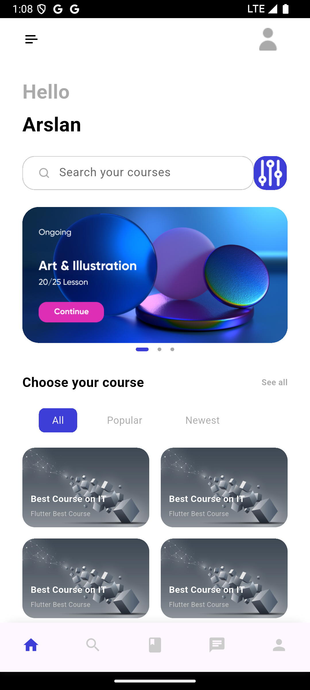
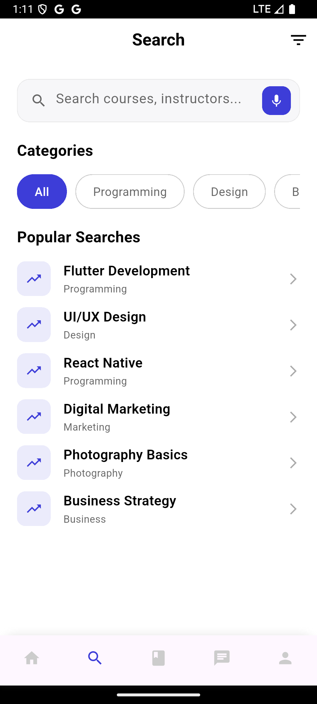
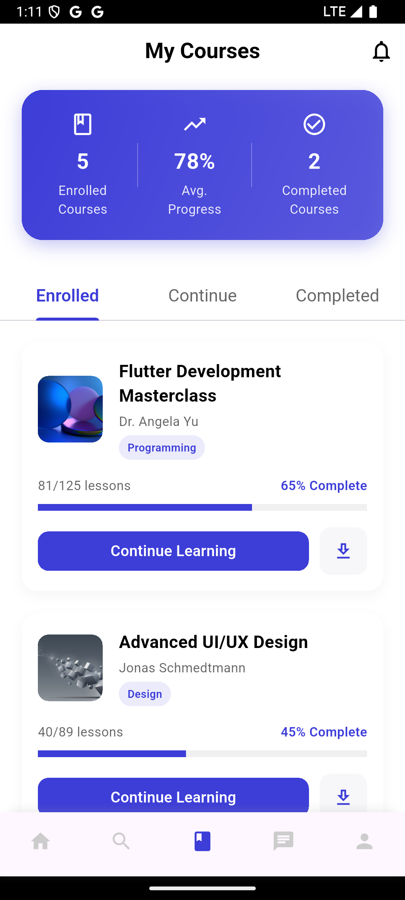
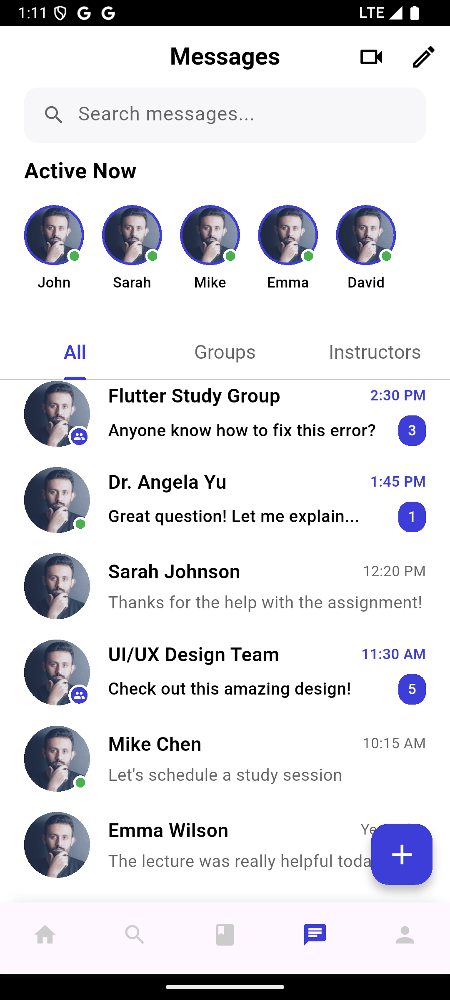
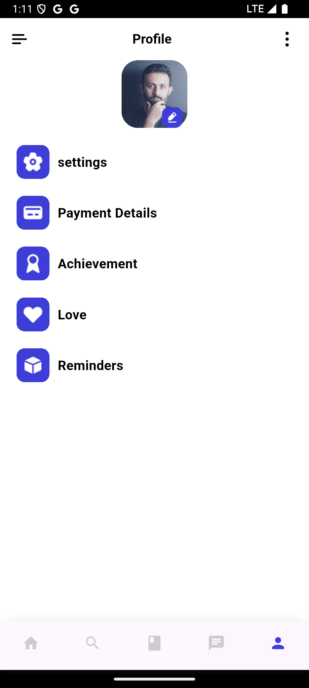
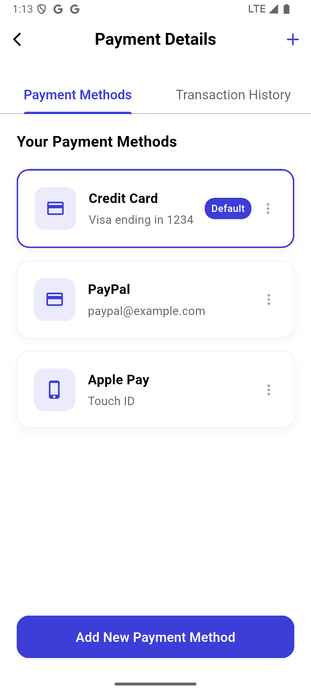
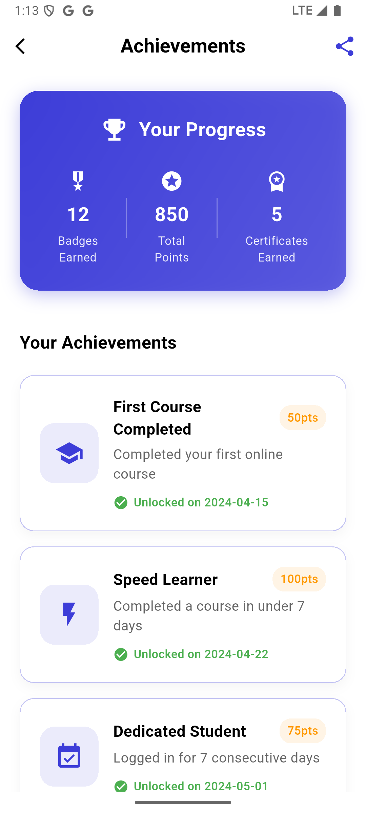
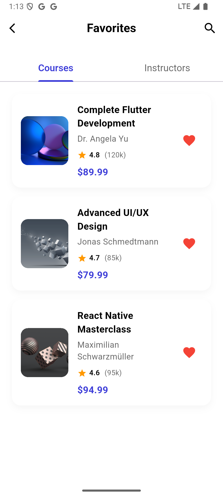
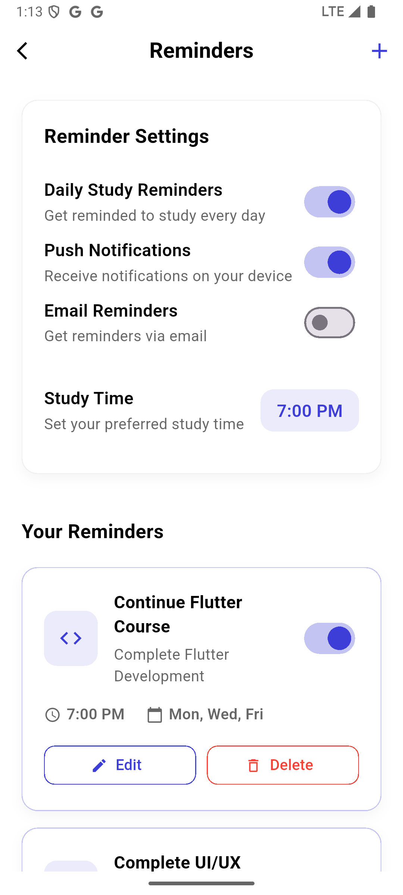

# 📚 Code Academy App

A modern and intuitive Flutter-based learning management system (LMS) designed to provide an exceptional online learning experience. This app features a clean UI, comprehensive course management, interactive features, and seamless navigation.

## ✨ Features

### 🏠 **Home Screen**
- **Welcome Dashboard**: Personalized greeting with user name
- **Search Functionality**: Advanced search with filters and suggestions
- **Course Slider**: Featured courses with beautiful image carousels
- **Category Menu**: Organized course categories (All, Popular, New, etc.)
- **Course Grid**: Interactive grid layout displaying available courses

### 🔍 **Search Screen**
- **Smart Search Box**: Real-time search with voice input support
- **Category Filters**: Filter courses by Programming, Design, Business, Marketing, Photography
- **Popular Searches**: Trending and suggested search terms
- **Search Results**: Detailed course listings with ratings, pricing, and instructor info

### 📖 **Courses Screen**
- **Course Statistics**: Visual progress tracking with badges and points
- **Tabbed Interface**: Enrolled, Continue Learning, and Completed sections
- **Progress Tracking**: Visual progress bars and completion status
- **Course Cards**: Detailed course information with thumbnails

### 💬 **Chat Screen**
- **Message Interface**: Clean chat layout with search functionality
- **Contact List**: Organized list of instructors and fellow students
- **Real-time Messaging**: Interactive chat system (UI ready)
- **Media Support**: Support for various message types

### 👤 **Profile Screen**
- **User Profile**: Editable profile with photo upload
- **Settings Navigation**: Quick access to app settings
- **Feature Menu**: Payment Details, Achievements, Favorites, Reminders

#### **Profile Sub-Screens:**

**💳 Payment Details**
- **Payment Methods**: Manage credit cards, PayPal, Apple Pay
- **Transaction History**: Complete purchase and refund history
- **Add New Methods**: Easy payment method addition

**🏆 Achievements**
- **Badge System**: Unlock achievements with points and progress tracking
- **Statistics Dashboard**: Total badges, points, and certificates
- **Progress Tracking**: Visual progress bars for ongoing achievements

**❤️ Favorites**
- **Course Favorites**: Save and manage favorite courses
- **Instructor Favorites**: Follow preferred instructors
- **Quick Access**: Easy access to saved content

**⏰ Reminders**
- **Study Reminders**: Custom study schedule notifications
- **Notification Settings**: Granular control over app notifications
- **Daily Goals**: Set and track daily learning objectives

## 🛠️ Technology Stack

- **Framework**: Flutter 3.x
- **Language**: Dart
- **State Management**: Flutter Bloc/Cubit
- **Navigation**: Named routes with custom route management
- **UI Framework**: Material Design 3
- **Responsive Design**: flutter_screenutil for adaptive layouts
- **Backend**: Firebase (Authentication, Firestore, Cloud Storage)
- **Local Storage**: SharedPreferences
- **Notifications**: Local notifications support

## 📱 Screenshots

### Main Navigation Screens
<div align="center">
  
  
  
  
  
</div>

### Profile Feature Screens
<div align="center">
  
  
  
  
</div>

## 🚀 Getting Started

### Prerequisites

- Flutter SDK (3.0 or higher)
- Dart SDK (3.0 or higher)
- Android Studio / VS Code
- Firebase account for backend services

### Installation

1. **Clone the repository**
   ```bash
   git clone https://github.com/arslanyousaf12/code_academy_app.git
   cd code_academy_app
   ```

2. **Install dependencies**
   ```bash
   flutter pub get
   ```

3. **Configure Firebase**
   - Create a new Firebase project
   - Add Android/iOS apps to your Firebase project
   - Download `google-services.json` (Android) and `GoogleService-Info.plist` (iOS)
   - Place them in the respective platform directories

4. **Run the app**
   ```bash
   flutter run
   ```

### Configuration

1. **Firebase Setup**
   ```bash
   # Install Firebase CLI
   npm install -g firebase-tools
   
   # Login to Firebase
   firebase login
   
   # Configure Firebase for Flutter
   dart pub global activate flutterfire_cli
   flutterfire configure
   ```

2. **Android NDK Configuration**
   
   Update `android/app/build.gradle.kts`:
   ```kotlin
   android {
       ndkVersion = "27.0.12077973"
       // ... other configurations
   }
   ```

## 📁 Project Structure

```
lib/
├── main.dart                          # App entry point
├── app_bloc_providers.dart           # Global BLoC providers
├── global.dart                       # Global app state
├── firebase_options.dart             # Firebase configuration
├── common/                           # Shared utilities
│   ├── routes/                       # Navigation routes
│   ├── values/                       # Constants and colors
│   └── widgets/                      # Reusable widgets
└── screens/                          # All app screens
    ├── application/                  # Main app dashboard
    ├── welcome/                      # Welcome screens
    ├── sigin_in/                     # Authentication
    ├── register/                     # User registration
    ├── home/                         # Home screen
    ├── search/                       # Search functionality
    ├── courses/                      # Course management
    ├── chat/                         # Messaging system
    └── profile/                      # User profile & sub-screens
        ├── settings/                 # App settings
        ├── payment_details/          # Payment management
        ├── achievement/              # Achievement system
        ├── favorites/                # Favorites management
        └── reminders/                # Reminder settings
```

## 🎨 Design System

### Color Palette
- **Primary**: `#3D3DD8` (Blue)
- **Background**: `#FFFFFF` (White)
- **Secondary Background**: `#F7F7F9` (Light Gray)
- **Text Primary**: `#000000` (Black)
- **Text Secondary**: `#666666` (Gray)
- **Text Tertiary**: `#AAAAAA` (Light Gray)

### Typography
- **Primary Font**: Avenir
- **Secondary Font**: Montserrat
- **Responsive Sizing**: flutter_screenutil for adaptive text sizes

### Components
- **Consistent Border Radius**: 15px for cards, 20px for major containers
- **Shadow System**: Consistent elevation and blur effects
- **Icon System**: Material Icons with custom asset icons

## 🔧 Development

### Code Architecture

The app follows a clean architecture pattern with:

- **BLoC Pattern**: For state management across all screens
- **Repository Pattern**: For data layer abstraction
- **Dependency Injection**: Using Provider/BLoC for service injection
- **Modular Structure**: Each feature in its own module

### Key Features Implementation

1. **Navigation System**: Custom route management with named routes
2. **State Management**: BLoC/Cubit for reactive state updates
3. **Responsive Design**: Adaptive layouts for different screen sizes
4. **Error Handling**: Comprehensive error handling and user feedback
5. **Performance**: Optimized images and lazy loading

### Adding New Features

1. Create new screen directory under `lib/screens/`
2. Implement BLoC for state management
3. Add routes to `common/routes/`
4. Update navigation in `app_widgets.dart`
5. Add tests for new functionality

## 📄 Dependencies

### Core Dependencies
```yaml
dependencies:
  flutter: sdk
  flutter_bloc: ^8.1.3
  flutter_screenutil: ^5.9.0
  firebase_core: ^2.24.2
  firebase_auth: ^4.15.3
  cloud_firestore: ^4.13.6
  shared_preferences: ^2.2.2
  dots_indicator: ^3.0.0
  fluttertoast: ^8.2.4
```

### Dev Dependencies
```yaml
dev_dependencies:
  flutter_test: sdk
  flutter_lints: ^3.0.0
```

## 🧪 Testing

Run tests with:
```bash
# Unit tests
flutter test

# Widget tests
flutter test test/widget_test.dart

# Integration tests
flutter test integration_test/
```

## 🚢 Deployment

### Android
```bash
# Build APK
flutter build apk --release

# Build App Bundle
flutter build appbundle --release
```

### iOS
```bash
# Build for iOS
flutter build ios --release
```

## 🤝 Contributing

1. Fork the repository
2. Create a feature branch (`git checkout -b feature/amazing-feature`)
3. Commit changes (`git commit -m 'Add amazing feature'`)
4. Push to branch (`git push origin feature/amazing-feature`)
5. Open a Pull Request

## 📋 TODO / Roadmap

- [ ] **Video Player Integration**: Add video lessons support
- [ ] **Offline Mode**: Download courses for offline viewing
- [ ] **Push Notifications**: Real-time notifications
- [ ] **Social Features**: Student discussion forums
- [ ] **Advanced Analytics**: Learning progress analytics
- [ ] **Multi-language Support**: Internationalization
- [ ] **Dark Mode**: Theme switching capability
- [ ] **Accessibility**: Enhanced accessibility features

## 🐛 Known Issues

- Voice input in search requires microphone permissions
- Some animations may lag on older devices
- Firebase configuration required for full functionality

## 📞 Support

For support and questions:
- Email: support@codeacademyapp.com
- GitHub Issues: [Create an issue](https://github.com/yourusername/code_academy_app/issues)

## 📄 License

This project is licensed under the MIT License - see the [LICENSE](LICENSE) file for details.

## 👏 Acknowledgments

- Flutter team for the amazing framework
- Firebase for backend services
- Material Design for UI components
- Community contributors and testers

---

**Made with ❤️ by Arslan **

*A comprehensive learning management system built with Flutter*
